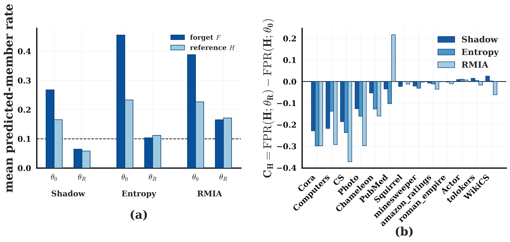
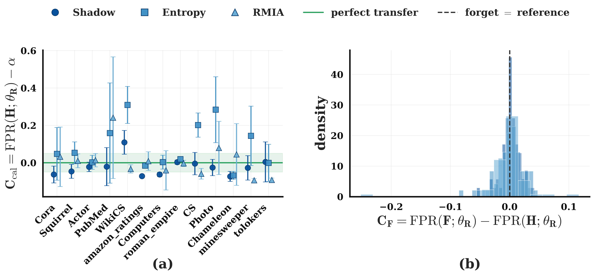
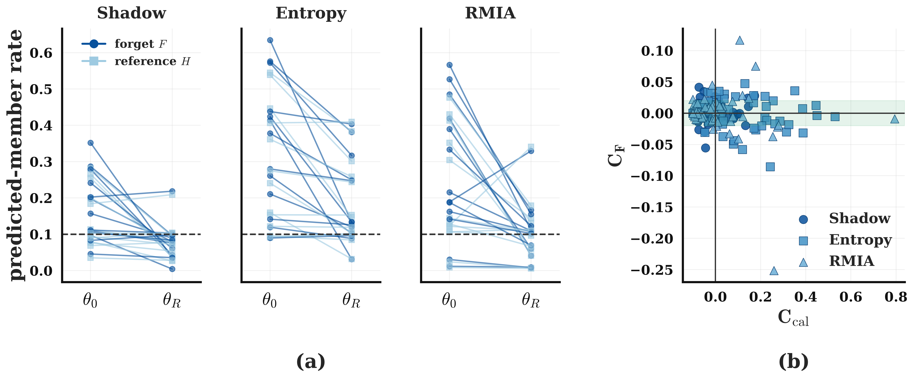

# Rethinking Membership Inference for Unlearning
### A Reference-Relative View on Federated Graphs

Code and results for our study of whether a **membership inference attack (MIA)** is a
reliable way to verify unlearning in **federated graph learning**.

Instead of attacking an approximately unlearned model, we apply a *frozen,
out-of-sample-calibrated* attack to the **retrain-from-scratch (RTS)** reference — the
model whose forgetting state is known by construction — and read the forget set against
a **matched supervised non-member reference** rather than treating the absolute attack
score as a standalone forgetting measure. We evaluate three attacks (shadow-model,
modified prediction-entropy, and offline RMIA) across **13 datasets × 5 seeds = 65
cells**.

> **Topics:** federated graph learning · machine unlearning · membership inference ·
> privacy auditing · graph neural networks

The paper's code and results live in **[`fgu_mia/`](fgu_mia/)**. Earlier exploratory
work and superseded iterations are preserved in **[`archive/`](archive/)**.

---

## Contents

- [Key finding](#key-finding)
- [Results at a glance](#results-at-a-glance)
- [Figures](#figures)
- [Repository layout](#repository-layout)
- [Setup](#setup)
- [Pipeline](#pipeline)
- [Reproduce](#reproduce)
- [Configuration and output schema](#configuration-and-output-schema)
- [Tests](#tests)
- [Citation](#citation)
- [Archive](#archive)

---

## Key finding

An **absolute MIA rate at a fixed operating point is not a transportable indicator of
forgetting** in federated graph learning: on the retrain-from-scratch model — where the
forget set is a non-member by construction — the realized rate on a matched reference
still drifts with dataset, attack, and seed. In contrast, the **reference-relative
contrast** between the forget set and a matched non-member reference is, on average,
close to zero and far more concentrated, and this holds even where the attacks are
discriminative. We therefore recommend reading MIA output **relative to a matched
reference** rather than as an absolute forgetting score.

---

## Results at a glance

Across the 65 cells, measured on the retrain-from-scratch model at operating point
α = 0.10:

| Quantity | Shadow | Entropy | RMIA |
|---|---|---|---|
| Mean attack strength (AUC, common pool) | 0.544 | 0.563 | 0.581 |
| Mean forget-vs-reference contrast C_F | +0.002 | −0.0004 | −0.001 |
| Concentration: std(C_cal) / std(C_F) | 4.4× | 6.6× | 3.6× |

The reference-relative contrast C_F sits near zero while the absolute calibration
deviation C_cal is several times more dispersed — the core of the paper's argument.

On the cells where each attack is discriminative (AUC ≥ 0.60), the forget set is clearly
more member-like than the reference **before** retraining (mean gaps +0.10 / +0.22 /
+0.16 for Shadow / Entropy / RMIA) and the gap **collapses to within ±0.01 after**
retraining — so the near-zero post-retraining contrast is not merely an artifact of weak
attacks.

---

## Figures

**Forget-versus-reference, before and after retraining.** Left: on the discriminative
cells, the forget set (F) is more member-like than the matched reference (H) under the
original model θ₀, and the two align under the retrained model θ_R. Right: the reference
shift C_H per dataset, consistent across the three attacks.



**Calibration transfer and the forget-versus-reference contrast.** Left: the calibration
deviation C_cal per dataset varies across settings. Right: the distribution of C_F is
concentrated near zero for all three attacks.



**Membership transition under retraining.** Left: predicted-member rate on F and H under
θ₀ and θ_R, shown per attack on a shared scale. Right: C_cal versus C_F across all cells.



---

## Repository layout

```
.
├── fgu_mia/                  Canonical pipeline and results for the paper
│   ├── models.py             GNN model, dataset loaders, per-dataset config
│   ├── partition.py          Louvain community-aware partitioning + splits
│   ├── train.py              federated training; original (M0) and RTS (MR) models
│   ├── attack.py             shadow-model MIA, out-of-sample calibration at alpha
│   ├── metrics.py            train/test generalization gap
│   ├── nodelog.py            per-node logging + run manifest
│   ├── experiment_main.py    Stage 1: core run -> results_13x5/raw/
│   ├── build_references.py   Stage 2: reference-model pack per cell
│   ├── score_and_match.py    Stage 3: entropy + RMIA scores, common-pool AUC
│   ├── rethreshold_rmia.py   Stage 4: RMIA threshold frozen on M0
│   ├── aggregate_extension.py Stage 5: roll up -> summary CSVs
│   ├── make_combined_figures.py Stage 6: paper figures
│   ├── run_full_extension.sh  driver for Stages 2-3 over all 65 cells
│   ├── test_acceptance.py    core-run integrity checks
│   ├── test_extension.py     extension integrity checks
│   ├── summary_core.csv      shadow-model attack, per cell (common pool)
│   ├── summary_entropy.csv   prediction-entropy attack, per cell
│   ├── summary_rmia.csv      offline RMIA, per cell (frozen-M0 threshold)
│   ├── figs/                 the paper figures (PDF + PNG)
│   ├── results_13x5/         frozen core run (per-node logs + manifests)
│   ├── extension_results_20260930_174043/  the extension run behind the paper
│   ├── legacy/               superseded scripts/summaries (see its README)
│   ├── README.md             pointer to this file
│   ├── README_attack_extension.md  detailed extension notes
│   └── requirements.txt
├── archive/                  Prior / superseded / unrelated material (see Archive)
├── requirements.txt
└── README.md                 (this file)
```

---

## Setup

```bash
python -m venv venv && source venv/bin/activate
pip install -r requirements.txt
```

Developed with Python 3.11 and PyTorch 2.x. A GPU is recommended (training all cells is
expensive on CPU). Datasets download automatically on first use via PyTorch Geometric;
the heterophilous datasets come from the Yandex heterophilous-graphs release. For
Chameleon and Squirrel the filtered versions of Platonov et al. (2023) are used
(duplicate nodes removed to prevent train/test leakage).

---

## Pipeline

A **cell** is one (dataset, seed) pair: 13 datasets × 5 seeds = 65 cells. Each cell has a
`<tag>` of the form `<dataset>_client_s<seed>` (e.g. `Cora_client_s42`).

```
experiment_main.py          results_13x5/raw/            Stage 1  (ROOT source)
        |
        v
run_full_extension.sh       extension_results_<stamp>/   Stages 2-3
   |- build_references.py        reference/refpack_<tag>.json
   |- score_and_match.py         scores/nodescores_<tag>.csv, scores/attackmeta_<tag>.json
        |
        v
aggregate_extension.py      summary_entropy.csv, summary_rmia.csv   Stage 5
        |
        v
rethreshold_rmia.py         summary_rmia_rethresholded.csv + *_commonpool.csv   Stage 4
        |
        v
make_combined_figures.py    figs/*.pdf, figs/*.png                   Stage 6
```

**Stage 1 — core run (`experiment_main.py`).** Partitions each graph, trains the original
model M0 (all clients) and the retrain-from-scratch reference MR (retained clients only),
fits and freezes the shadow-model attack, and logs every evaluated node under both models.
Writes `results_13x5/raw/nodelog_<tag>.csv` and `manifest_<tag>.json`, and the
shadow-model summary used as `summary_core.csv`.

**Stages 2-3 — extension attacks (`run_full_extension.sh`).** `build_references.py` reads
the frozen logs and writes `reference/refpack_<tag>.json`; `score_and_match.py` writes
`scores/nodescores_<tag>.csv` and `scores/attackmeta_<tag>.json` (including the common-pool
AUC on E⁺ ∪ E⁻); `test_extension.py` spot-checks a few cells.

**Stage 4 — RMIA re-thresholding (`rethreshold_rmia.py`).** Computes the RMIA threshold on
M0, freezes it, and applies the same threshold to both M0 and MR (offline; no rescoring or
retraining). With `--core-csv`/`--entropy-csv` it also writes common-pool versions of the
Shadow and Entropy summaries.

**Stage 5 — aggregate (`aggregate_extension.py`).** Rolls all cells into
`summary_entropy.csv` and `summary_rmia.csv`.

**Stage 6 — figures (`make_combined_figures.py`).** Reads the three summaries and writes
`figs/fig_rq2rq3`, `figs/fig_rq4_overview`, `figs/fig_impact` (PDF + PNG).

---

## Reproduce

All commands run from inside `fgu_mia/`.

**A. Figures only (from the committed summaries):**

```bash
cd fgu_mia
python make_combined_figures.py \
  --attacks shokri=summary_core.csv entropy=summary_entropy.csv rmia=summary_rmia.csv \
  --out figs
```

**B. Summaries + figures (from the committed core run):**

```bash
cd fgu_mia

# Stages 2-3: build references + score all 65 cells (reads results_13x5/raw/)
bash run_full_extension.sh                       # writes extension_results_<stamp>/

# Stage 5: initial aggregate
python aggregate_extension.py \
  --ext-dir extension_results_<stamp> --alpha 0.10 --out-dir .

# Stage 4: freeze RMIA threshold on M0; also write common-pool Shadow/Entropy summaries
python rethreshold_rmia.py \
  --ext-dir extension_results_<stamp> \
  --out-dir extension_results_<stamp>_rmiafix \
  --core-csv summary_core.csv --entropy-csv summary_entropy.csv

# adopt the corrected summaries as canonical
cp extension_results_<stamp>_rmiafix/summary_rmia_rethresholded.csv summary_rmia.csv
cp extension_results_<stamp>_rmiafix/summary_core_commonpool.csv    summary_core.csv
cp extension_results_<stamp>_rmiafix/summary_entropy_commonpool.csv summary_entropy.csv

# Stage 6: figures
python make_combined_figures.py \
  --attacks shokri=summary_core.csv entropy=summary_entropy.csv rmia=summary_rmia.csv \
  --out figs
```

To reproduce the paper's numbers exactly, use the committed run
`extension_results_20260930_174043` as `--ext-dir`.

**C. Everything from scratch (retrains all cells — expensive):**

```bash
cd fgu_mia
python experiment_main.py \
  --datasets Cora PubMed CS Photo Computers WikiCS Chameleon Squirrel Actor \
             tolokers minesweeper amazon_ratings roman_empire \
  --seeds 7 42 99 123 456 \
  --scenario client --n-shadow 5 --core --out-dir results_13x5
# then Stages 2-6 as in B
```

`experiment_main.py` flags: `--datasets`, `--seeds`, `--scenario` (default `client`),
`--out-dir` (default `results`), `--n-shadow` (default 5), `--core`, `--overwrite`.

---

## Configuration and output schema

13 datasets × 5 seeds (7, 42, 99, 123, 456) = 65 cells. Operating point α = 0.10 (nominal;
threshold from empirical quantiles, so the realized rate is not always exactly 0.10).
Client-level removal with forget ratio ρ = 0.20. Offline RMIA with a = 1, 5 OUT reference
models, γ = 2. Per-dataset hyper-parameters are in the paper's configuration tables.

Each row of a summary CSV is one cell:

| Column | Meaning |
|---|---|
| `attack_strength_auc` | AUC on the common pool E⁺ ∪ E⁻ under MR (comparable across attacks) |
| `C_cal` | FPR(H; MR) − α — drift of the operating point on the matched reference |
| `C_F` | FPR(F; MR) − FPR(H; MR) — forget set vs matched reference (≈ 0 ⇒ behaves like a non-member) |
| `C_H` | FPR(H; MR) − FPR(H; M0) — shift of the same non-member reference between models |
| `forget_member_rate_M0/MR` | realized forget-set member rate under each model |
| `heldout_member_rate_M0/MR` | realized reference member rate under each model |

---

## Tests

```bash
cd fgu_mia
python test_acceptance.py      # core-run integrity (reads results_13x5/)
python test_extension.py --tag Cora_client_s42 \
  --frozen-dir results_13x5/raw --out-dir extension_results_<stamp>
```

See `fgu_mia/README_attack_extension.md` for detailed extension notes and
`fgu_mia/legacy/README.md` for the archived scripts.

---

## Citation

```bibtex
@unpublished{huda2026rethinking,
  title  = {Rethinking Membership Inference for Unlearning:
            A Reference-Relative View on Federated Graphs},
  author = {Huda, S M Asiful and Giampaolo, Fabio and Piccialli, Francesco},
  note   = {Under review, Neural Networks (Elsevier)},
  year   = {2026}
}
```

---

## Archive

[`archive/`](archive/) holds prior and unrelated material, kept for provenance:

- `01_main_study/`–`04_subsample/` — an earlier four-experiment study (main study,
  matched control, partitioning/clients/forget-ratio sweeps, subsampling), with its own
  README and per-experiment guides in `archive/docs/`.
- `05_mia_redesigned/`, `06_mia_redesigned/` — earlier iterations of the redesigned
  pipeline, superseded by `fgu_mia/`.
- `MIA_2/`, `Subsample/`, `files (8)/`, `mia_control_variation/`, loose `mia_*.py` —
  prototype/scratch code and outputs.
- `plot/` — unrelated reinforcement-learning plots that were in the working tree.